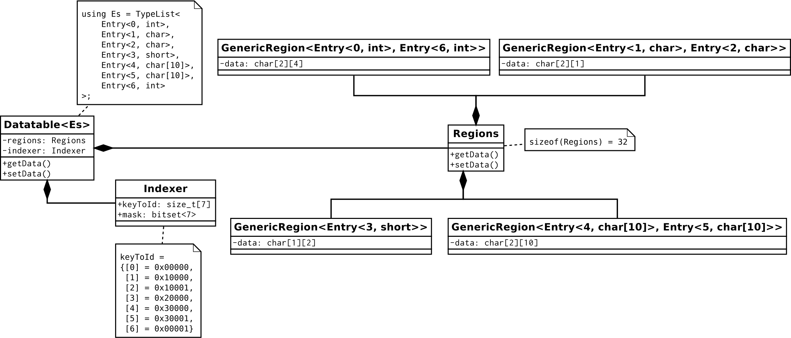

# Examples
## Datatable
Datatable is a key-value data structure, the key is enumerated type, 
and the value type can be variant, likes Android's metadata_t data structure.

The user needs to describe the key and value type entry list, 
to generate a compact Datatable,
for example, types with the same size will be grouped together.



As you can see, the same size types are grouped into the `GenericRegion` type,
all GenericRegion types will combine with the Regions class. 

The `Indexer` class records the key info that belongs to which GenericRegion's offset, 
the lower 16 bits is GenericRegion's offset, and upper bits is GenericRegion's id, 
`0x10000` indicates that the key `2` belongs to the first element of the second GenericRegion.
`Indexer::mask` record key has been set.

```cpp
constexpr auto all_entries = value_list<
    entry<0, int>,
    entry<1, char>,
    entry<2, char>,
    entry<3, short>,
    entry<4, char[10]>,
    entry<5, char[10]>,
    entry<6, int>
>;

Datatable<all_entries> datatbl;
datatbl.dumpGroupInfo();
```

it outputs:
```
sizeof Datatable = 64
sizeof Region = 32
sizeof Indexer = 32
key = 0 id = 0x00000 group = 0 subgroup = 0
key = 1 id = 0x10000 group = 1 subgroup = 0
key = 2 id = 0x10001 group = 1 subgroup = 1
key = 3 id = 0x20000 group = 2 subgroup = 0
key = 4 id = 0x30000 group = 3 subgroup = 0
key = 5 id = 0x30001 group = 3 subgroup = 1
key = 6 id = 0x00001 group = 0 subgroup = 1
```

The key is to use metaprogramming to generate types(type calculation):

Use this library:
```cpp
consteval bool operator==(KVEntry auto el, KVEntry auto er) {
    using ELType = decltype(el)::type;
    using ERType = decltype(er)::type;
    return el.dim == er.dim
           && sizeof(ELType) == sizeof(ERType)
           && alignof(ELType) == alignof(ERType);
}

consteval static concepts::list auto group_entries(concepts::list auto es) {
    if constexpr (es.empty()) {
        return value_list<>;
    } else {
        constexpr auto e = es.head();
        constexpr auto group_result = es | partition([](auto entry) { return entry == e; });
        return group_entries(group_result.second)
               | prepend(group_result.first);
    }
}
constexpr static auto entry_groups = group_entries(entries);

constexpr static auto regions_type = entry_groups
                                | transform([]<concepts::value_const auto... es>(ValueList<es...>)
                                                                                { return _t<GenericRegion<es.value...>>; })
                                | fold_left(_t<Regions<>>, []</* concepts::type_const */ typename GR, typename... GRs>
                                                             (TypeConst<Regions<GRs...>>, GR)
                                                             { return _t<Regions<GRs...,typename GR::type>>; });

constexpr static auto indexer_type = (entry_groups
        | fold_left(pair<0, value_list<>>, [](/* concepts::pair_const */ auto group_list, /* concepts::list */ auto group_entries) {
            constexpr auto res = group_entries
                   | fold_left(pair<0, value_list<>>, [group_list](concepts::pair_const auto inner_group, concepts::value_const auto entry) {
                       constexpr auto group_id = group_list.first;
                       constexpr auto inner_id = inner_group.first;
                       return pair<inner_id + 1, inner_group.second | append(pair<entry.value.key, (group_id << 16 | inner_id)>)>;
                    });
            return pair<group_list.first + 1, concat(group_list.second, res.second)>;
        })).second
        | fold_left(_t<Indexer<>>, []</* concepts::pair_const */ typename KeyWithId, concepts::pair_const auto... key_with_ids>
                                    (TypeConst<Indexer<key_with_ids...>>, KeyWithId) {
            return _t<Indexer<key_with_ids..., KeyWithId{}>>;
        });

get_typ<regions_type> regions;
get_typ<indexer_type> indexer;
```

Use TMP:

```
template<TL Es = TypeList<>, TL Gs = TypeList<>>
struct GroupEntriesTrait: Gs { };

template<TL Es = TypeList<>, TL Gs = TypeList<>>
using GroupEntriesTrait_t = typename GroupEntriesTrait<Es, Gs>::type;

template<KVEntry H, KVEntry ...Ts, TL Gs>
class GroupEntriesTrait<TypeList<H, Ts...>, Gs> {
    template<KVEntry E>
    using GroupPrediction = std::bool_constant<(H::dim == E::dim &&
            sizeof(typename H::type) == sizeof(typename E::type) &&
            alignof(typename H::type) == alignof(typename E::type))>;

    using Group = Partition_t<TypeList<H, Ts...>, GroupPrediction>;
    using Satisfied = typename Group::Satisfied;
    using Rest = typename Group::Rest;
public:
    using type = typename GroupEntriesTrait<Rest, typename Gs::template append<Satisfied>>::type;
};

template<TL Gs>
class GroupIndexTrait {
    template<size_t GroupIdx = 0, size_t InnerIdx = 0, TL Res = TypeList<>>
    struct Index {
        constexpr static size_t GroupIndex = GroupIdx;
        constexpr static size_t InnerIndex = InnerIdx;
        using Result = Res;
    };

    template<typename Acc, TL G>
    class AddGroup {
        constexpr static size_t GroupIndex = Acc::GroupIndex;
        template<typename Acc_, KVEntry E>
        class AddKey {
            constexpr static size_t InnerIndex = Acc_::InnerIndex;
            struct KeyWithIndex {
                constexpr static auto key = E::key;
                constexpr static auto id = (GroupIndex << 16) | InnerIndex;
            };
            using Result = typename Acc_::Result::template append<KeyWithIndex>;
        public:
            using type = Index<GroupIndex + 1, InnerIndex + 1, Result>;
        };
        using Result = typename Acc::Result;
    public:
        using type = Fold_t<G, Index<GroupIndex + 1, 0, Result>, AddKey>;
    };
public:
    using type = typename Fold_t<Gs, Index<>, AddGroup>::Result;
};

template<TL Gs>
using GroupIndexTrait_t = typename GroupIndexTrait<Gs>::type;

template<TL Gs>
class GenericRegionTrait {
    template<TL G>
    using ToRegion = Return<typename G::template to<GenericRegion>>;
public:
    using type = Map_t<Gs, ToRegion>;
};

template<TL Gs>
using GenericRegionTrait_t = typename GenericRegionTrait<Gs>::type;


using Gs = GroupEntriesTrait_t<Es>;
using RegionsClass = typename GenericRegionTrait_t<Gs>::template to<Regions>;
using IndexerClass = typename GroupIndexTrait_t<Gs>::template to<Indexer>;
```
